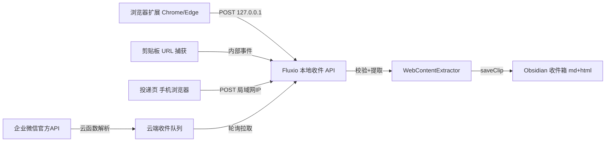
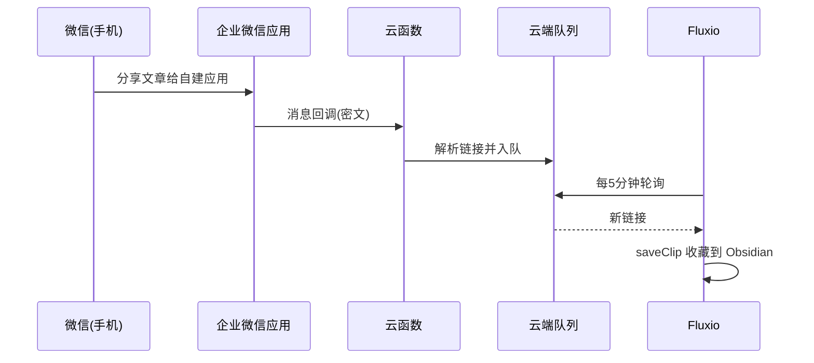

# Fluxio Inbox 收件箱设计

> 目标：微信、今日头条、任意网页 → 一键分享/投递到 Fluxio → **直接走现有收藏逻辑**（md + html 双份 → Obsidian）。
> 前置：Fluxio 为 Windows 桌面 Flutter 应用，无后端；收藏唯一入口 `ObsidianStore.saveClip(WebPageInfo, sourceTitle)`；已有剪贴板历史能力（`clipboard_history_screen`）。

## 1. 需求与场景

| 场景 | 用户动作 | 现实约束 |
|---|---|---|
| 网页（电脑端） | 浏览器点一下扩展图标 | 无约束，MVP 主场景 |
| 微信（电脑端） | 复制文章链接 | 已有剪贴板能力，可低成本捕获 |
| 今日头条（手机） | App 内"复制链接" → 投递 | 手机无法直连本机 127.0.0.1，需局域网/中转 |
| 微信（手机） | 文章"分享"给收件入口 | 封闭生态，仅官方 API 合规（企业微信） |

## 2. 总体架构



**核心原则：Fluxio 内嵌极简本地 HTTP 服务（dart:io HttpServer，零新依赖），收件后 100% 复用现有收藏链路。**

## 3. 本地收件 API（MVP 核心）

Fluxio 启动时在 `127.0.0.1:8730` 起 HttpServer（端口可配，冲突自动 +1）。

### 接口

| 方法/路径 | 用途 | 说明 |
|---|---|---|
| `POST /api/inbox` | 投递一条收藏 | Body: `{url, title?, source?, token}` |
| `GET /api/health` | 扩展探测服务存活 | 返回 `{ok:true, version}` |
| `GET /` | 投递页（P2） | 手机浏览器极简表单页 |

### POST /api/inbox 规范

请求头：`X-Inbox-Token: <token>`（或 body 内 token 字段）

```json
{
  "url": "https://mp.weixin.qq.com/s/xxxx",
  "title": "可选，缺省取页面标题",
  "source": "微信 | 今日头条 | 网页 | 剪贴板",
  "token": "flux-xxxx"
}
```

响应：

```json
{ "ok": true, "record": "2026-09-06-1234567890.md" }
```

失败：`{ "ok": false, "error": "INVALID_TOKEN" | "INVALID_URL" | "FETCH_FAILED" | "VAULT_NOT_CONFIGURED" }`

### 处理流程

1. 校验 token（Fluxio 设置页生成/重置，写入 shared_preferences）
2. 校验 URL 格式（http/https，防 file:// 等协议注入）
3. `WebContentExtractor` 提取正文 + 自包含 HTML 快照
4. 组装 `WebPageInfo` → `saveClip(info, sourceTitle)` 写 Obsidian 收件箱
5. 返回文件名；失败按错误码返回，扩展可提示

### 安全边界

- MVP 只绑定 `127.0.0.1`（本机扩展/剪贴板用），不暴露局域网
- token 防本机其他进程误投；日志不记录 token
- 不限制 URL 域名（用户自己的收藏自由），但拒绝 `file://`、`data:`、`javascript:` 等非 http 协议

## 4. 浏览器扩展（MVP）

`tool/extension/`（Chrome/Edge 共用 MV3）：

- `manifest.json`：权限仅 `activeTab` + `tabs`（读当前页 URL/标题），无 host_permissions（运行时向 127.0.0.1 发请求）
- 点击图标 → 取当前页 url/title → `fetch('http://127.0.0.1:8730/api/inbox')` → 成功打 ✓ 徽标，失败弹错误
- 选项页：配置 host + token（Fluxio 设置页显示 token 供复制）
- 参考：Hoarder/wallabagger 扩展（开源，已验证此模式成熟）

## 5. 剪贴板 URL 捕获（MVP+）

复用现有剪贴板历史：剪贴板出现 `http(s)://` 链接时，底部弹条「📥 收藏到 Fluxio？(来源: xxx)」→ 一键确认走 `POST /api/inbox`。

- **只提示不自动收藏**，避免误投
- 覆盖微信电脑端：复制链接 → 弹条 → 收藏，2 秒完成

## 6. 局域网投递页（P2，覆盖手机头条）

- 设置页开关「局域网投递」：启动时额外绑定 `0.0.0.0:8730`，显示局域网 IP（`http://192.168.x.x:8730`）
- 手机浏览器打开 → 极简页面：URL 输入框 + 标题（可选）+ 收藏按钮
- 用户手机头条复制链接 → 浏览器贴入 → 收藏
- 安全：仅绑定后可用；提示「请勿在公共网络开启」；可选 token 预填

## 7. 企业微信接入（P3，微信手机端合规方案）

**不碰个人微信机器人（wechaty/wxauto 有封号风险）。** 全官方 API：

1. 企业微信自建应用，接收"发送给应用"的消息（个人微信文章分享到企微应用对话）
2. 消息回调（URL 校验 + AES 解密）→ 腾讯云函数/阿里 FC（免费额度）解析出文章链接
3. 云函数把链接写入**云端收件队列**（私有 GitHub Gist / COS / KV 皆可）
4. Fluxio 每 5 分钟轮询队列 → 拉新链接 → 走本地收件流程收藏



> 合规要点：个人微信不做任何协议破解；企微官方回调 + 云函数，生产可用无封号风险。

## 8. 复用清单（已有代码零改动）

| 现有能力 | 复用处 |
|---|---|
| `ObsidianStore.saveClip` | 收件 API 最终落地（唯一收藏入口） |
| `WebPageInfo` 模型 | 组装投递数据 |
| `WebContentExtractor` | 正文 + HTML 快照提取 |
| 剪贴板历史服务 | URL 捕获监听 |
| `SourceWebView` 详情渲染 | 收藏后打开确认（可选） |

## 9. 分期计划

| 期 | 范围 | 工作量 |
|---|---|---|
| **MVP** | 本地收件 API + 设置页 token + Chrome 扩展 + 剪贴板弹条 | 2-3 天 |
| **P2** | 局域网投递页（手机头条场景） | 0.5 天 |
| **P3** | 企业微信官方 API + 云函数 + 云端队列轮询 | 2-3 天 |

## 10. 风险与对策

| 风险 | 对策 |
|---|---|
| 本地 API 被其他进程投递 | token 校验 + 仅 127.0.0.1（MVP） |
| 局域网开启后误暴露 | 默认关闭 + 网络提示 + token |
| 微信封号 | 只走企微官方 API，个人微信零介入 |
| 剪贴板误报 | 只提示、不自动收藏 |
| 收藏内容无法打开 | 直接复用现有 HTML 快照方案（自包含） |

## 附：验收标准

- [ ] 浏览器扩展一键收藏 → Obsidian 收件箱出现 md+html 双份
- [ ] 剪贴板复制链接 → 弹条 → 确认收藏成功
- [ ] 手机投递页 → 收藏成功（P2）
- [ ] 微信分享到企微 → 5 分钟内出现在收件箱（P3）
